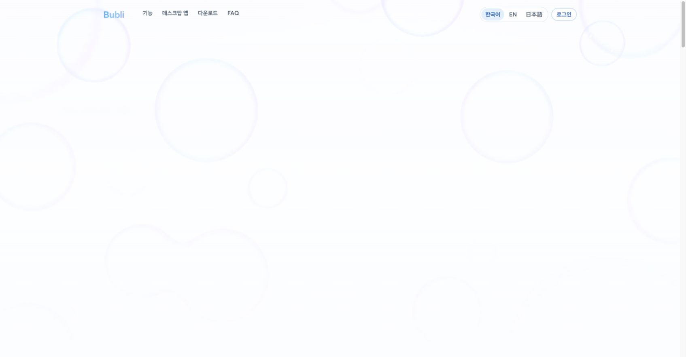
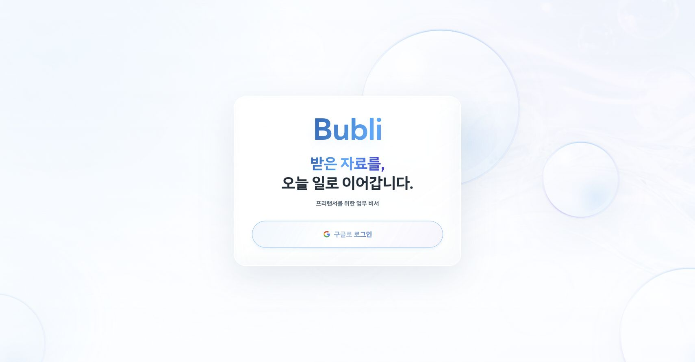
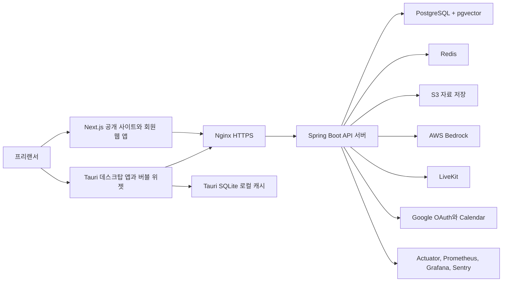

# Bubli

> 받은 자료를, 오늘 할 일로 바꾸는 프리랜서 업무 비서

Bubli는 계약서, 요구사항, 회의록처럼 흩어진 자료를 프로젝트룸에 모으고, 에이전트가 만든 업무 후보를 사용자가 승인해 대시보드와 데스크탑 버블 위젯에서 이어서 확인하게 해주는 팀 프로젝트입니다.




## 🧭 프로젝트 한눈에 보기

| 항목 | 내용 |
|---|---|
| 팀명 | 해 매일 |
| 개발 기간 | 2026.06.15 ~ 2026.07.10 |
| 개발 형태 | KOSTA AI Java DevOps 파이널 프로젝트, 5인 팀 |
| 프로젝트 성격 | Next.js 웹, Tauri 데스크탑 앱, Spring Boot 백엔드, AWS 배포 |
| 핵심 목표 | 프리랜서가 받은 자료를 확인 항목, 작업 구조, 할 일, 일정으로 이어지게 만든다 |
| 현재 기준 | 2026.07.10 기준 배포 화면과 `bubli-frontend`, `bubli-backend`의 `origin/develop` 코드를 확인해 정리 |

## 🔗 주요 링크

| 구분 | 링크 |
|---|---|
| 배포 서비스 | [https://bubli.n-e.kr/](https://bubli.n-e.kr/) |
| 프론트엔드 저장소 | [kosta-dev-sjh/bubli-frontend](https://github.com/kosta-dev-sjh/bubli-frontend) |
| 백엔드 저장소 | [kosta-dev-sjh/bubli-backend](https://github.com/kosta-dev-sjh/bubli-backend) |
| 상세 위키 | [p3-bubli Wiki](https://github.com/kosta-dev-sjh/p3-bubli/wiki) |
| 구현 스냅샷 | [Implementation Snapshot v16](https://github.com/kosta-dev-sjh/p3-bubli/wiki/14_Implementation-Snapshot-v16) |
| 현재 화면 | [Current Screens v16](https://github.com/kosta-dev-sjh/p3-bubli/wiki/15_Current-Screens-v16) |
| 트러블슈팅 | [Troubleshooting Home](https://github.com/kosta-dev-sjh/p3-bubli/wiki/20_Troubleshooting_Home) |

## 💡 왜 만들었나

프리랜서의 업무는 자료에서 시작됩니다. 계약서는 메일에 있고, 수정 요청은 메신저에 있고, 회의 결정은 회의록에 남습니다. 하지만 일을 시작할 때 필요한 것은 파일 목록이 아니라 오늘 무엇을 해야 하는지입니다.

Bubli는 이 빈 구간을 줄이기 위해 만들었습니다. 자료를 보관하는 데서 끝내지 않고, 자료 속 확인할 점과 업무 후보를 만들고, 사용자가 승인한 일만 실행 화면으로 넘기는 흐름을 설계했습니다.

## ✨ 핵심 기능

| 흐름 | 사용자가 얻는 것 | 구현 근거 |
|---|---|---|
| 구글 로그인 | 별도 회원가입 없이 서비스에 진입 | `AuthController`, `/api/auth/google/*`, `/login` |
| 프로젝트룸 | 자료, 작업, 채팅, 일정을 하나의 업무 기준으로 묶음 | `/api/project-rooms`, `/app/project-rooms/[roomId]` |
| 자료보드 | 계약서, 회의록, 요구사항 문서를 프로젝트룸에 모음 | `ResourceController`, `DocumentController`, S3 저장 구조 |
| 에이전트 후보 | 요약, 확인 질문, 요구사항, 작업 구조, 할 일 후보 생성 | `AgentJobController`, `AgentSuggestionController`, `ProjectRoomAgentCommandController` |
| 승인 기반 반영 | AI 결과를 바로 확정하지 않고 사용자가 검토 | `agent_suggestions`, 승인 API, 작업/일정 도메인 분리 |
| 작업 구조와 할 일 | 승인된 후보를 작업판, 대시보드, 위젯으로 연결 | `WbsItemController`, `TaskController`, `/app/project-rooms/[roomId]/work` |
| 소통과 보이스 | 프로젝트룸, 그룹, 1대1 대화와 음성 연결 | WebSocket/STOMP, `ChatController`, `VoiceRoomController`, LiveKit |
| 데스크탑 버블 위젯 | 작업 화면 위에서 오늘 업무와 알림을 확인 | Tauri 2, Rust, `/desktop-widget`, `WidgetController` |
| 로컬 개인 기능 | 개인 폴더, 활동 기록, 위젯 사용 집계를 로컬에서 처리 | Tauri SQLite, local file sync, activity capture |

## 🖼️ 화면 미리보기

| 화면 | 설명 |
|---|---|
|  | 배포 서비스의 공개 홈. 서비스 소개, 다운로드, 로그인 진입을 맡습니다. |
|  | 구글 로그인 단일 진입 화면입니다. |

회원 앱 내부 화면과 데스크탑 위젯 화면은 로그인 세션과 실행 환경에 따라 달라집니다. 최신 화면 묶음은 [위키 화면 문서](https://github.com/kosta-dev-sjh/p3-bubli/wiki/15_Current-Screens-v16)에 정리했습니다.

## 🏗️ 시스템 구조



핵심 원칙은 간단합니다. 권한과 원본은 서버가 책임지고, 웹과 Tauri는 같은 API 서버를 거칩니다. AI 결과도 바로 업무 데이터가 되지 않고, 후보로 저장된 뒤 사용자 승인 흐름을 거칩니다.

## 🛠️ 기술 스택과 선택 이유

| 영역 | 기술 | 선택 이유 |
|---|---|---|
| 프론트엔드 | Next.js 16, React 19, TypeScript | 공개 사이트와 로그인 후 회원 앱을 한 코드베이스에서 나누기 위해 선택 |
| 데스크탑 | Tauri 2, Rust, SQLite | 웹 화면을 앱으로 감싸면서도 위젯 창, 로컬 폴더, 활동 기록처럼 데스크탑 기능을 붙이기 위해 선택 |
| 백엔드 | Spring Boot 3.4.1, Java 21, JPA, QueryDSL | 인증, 권한, 자료, 작업, 에이전트 흐름을 하나의 모듈형 모놀리스로 관리 |
| 데이터 | PostgreSQL, pgvector, Flyway | 원본 데이터와 벡터 검색을 같은 권한 경계 안에서 다루기 위해 선택 |
| AI/RAG | Spring AI 1.0.9, AWS Bedrock Converse, Titan Embedding | 문서 근거가 필요한 후보 생성과 자료 검색을 서버 책임으로 처리 |
| 소통 | WebSocket/STOMP, Redis, LiveKit | 채팅, 알림, 타이핑, 보이스룸 상태를 분리해 처리 |
| 배포와 관측 | Docker Compose, Nginx, EC2, RDS, S3, Terraform, Prometheus, Grafana, Sentry | 배포, 상태 확인, 오류 추적까지 발표와 운영 검증에 포함 |

## 🎯 주요 설계 판단

- 에이전트는 후보를 만들고, 사용자가 결정합니다. 잘못된 AI 결과가 바로 할 일이나 일정으로 확정되지 않게 했습니다.
- 프로젝트와 프로젝트룸을 나누지 않고 `project_rooms`를 실제 업무 단위로 통합했습니다. 자료, 멤버, 채팅, 작업의 권한 기준을 한 곳으로 모으기 위해서입니다.
- 초대는 수락된 친구 기반으로 제한했습니다. 링크 초대나 비회원 게스트는 편하지만, 프로젝트룸 자료와 보이스 권한을 흐리게 만들 수 있어 제외했습니다.
- 개인 자료와 프로젝트룸 자료를 분리했습니다. 로컬 개인 원문과 활동 상세는 Tauri SQLite에 두고, 서버에는 승인된 요약이나 집계만 올리는 구조로 설계했습니다.
- 벡터 검색은 pgvector로 PostgreSQL 안에 두었습니다. 원본 문서와 임베딩 권한을 따로 검증하지 않기 위해서입니다.

## ✅ 구현과 검증 근거

| 항목 | 현재 확인한 근거 |
|---|---|
| 프론트 라우트 | `origin/develop` 기준 `src/app` 페이지 라우트 22개 확인 |
| 백엔드 API | 컨트롤러 35개, 주요 엔드포인트는 위키 API 문서에 정리 |
| DB 변경 관리 | Flyway 마이그레이션 33개 확인 |
| 테스트 자산 | 백엔드 테스트 파일 133개, `@Test` 어노테이션 747개 확인 |
| 프론트 품질 게이트 | 디자인 토큰, 상품 규칙, i18n, Tauri 경계, 런타임 스모크 등 `scripts/check-*` 14개 확인 |
| 운영 설정 | Docker, Nginx, Prometheus, Grafana, Loki, Terraform 설정 확인 |
| 배포 화면 | 2026.07.10 Chrome에서 `https://bubli.n-e.kr/` 공개 홈과 로그인 화면 캡처 |

## 🔧 트러블슈팅

| 문제 | 원인 | 해결 | 남은 교훈 |
|---|---|---|---|
| S3 전환 뒤 업로드 501 응답 | 미연결 저장소 빈이 우선 등록되는 설정 문제 | `ConditionalOnProperty` 조건을 조정하고 위키에 재발 방지 기록 | 설정값보다 실제 등록된 빈을 먼저 확인 |
| 도메인 경계 위반 | 백엔드 도메인 간 직접 의존이 섞임 | ArchUnit 규칙으로 경계 위반을 테스트화 | 설계 원칙은 문서보다 테스트가 오래 지킨다 |
| Terraform tainted RDS 삭제 위험 | tainted 상태에서 RDS 재생성 흐름이 열림 | 삭제 보호와 상태 확인 절차를 위키에 기록 | 인프라 작업은 현재 상태 확인이 먼저다 |
| 로컬 파일 분석 알림 과다 | 동기화 이벤트와 분석 작업의 멱등성 경계가 약함 | idempotency key와 자동 분석 범위를 정리 | 로컬 자동화는 사용자 방해도를 함께 봐야 한다 |

자세한 기록은 [위키 트러블슈팅](https://github.com/kosta-dev-sjh/p3-bubli/wiki/20_Troubleshooting_Home)에 모았습니다.

## 📚 상세 문서

| 문서 | 내용 |
|---|---|
| [Project Overview](https://github.com/kosta-dev-sjh/p3-bubli/wiki/01_Project-Overview) | 서비스 문제, 사용자, 제품 정의 |
| [Service Structure and Flow](https://github.com/kosta-dev-sjh/p3-bubli/wiki/02_Service-Structure-and-Flow) | 프로젝트룸에서 위젯까지 이어지는 흐름 |
| [IA Screen Structure](https://github.com/kosta-dev-sjh/p3-bubli/wiki/03_IA-Screen-Structure) | 공개 사이트, 회원 앱, Tauri 화면 구조 |
| [Functional Requirements](https://github.com/kosta-dev-sjh/p3-bubli/wiki/04_Functional-Requirements) | 기능 요구사항 |
| [Tech Architecture](https://github.com/kosta-dev-sjh/p3-bubli/wiki/08_Tech-Architecture) | 시스템 구조와 기술 책임 |
| [Data Model](https://github.com/kosta-dev-sjh/p3-bubli/wiki/09_Data-Model) | 데이터 모델과 ERD |
| [API Design](https://github.com/kosta-dev-sjh/p3-bubli/wiki/10_API-Design) | API 설계 |
| [Development and QA](https://github.com/kosta-dev-sjh/p3-bubli/wiki/11_Development-and-QA) | 개발 기준과 검증 도구 |

## 🚀 로컬 실행

이 저장소는 포트폴리오 허브입니다. 실제 실행 코드는 프론트엔드와 백엔드 저장소에 있습니다.

```bash
git clone https://github.com/kosta-dev-sjh/bubli-frontend.git
git clone https://github.com/kosta-dev-sjh/bubli-backend.git
```

프론트엔드와 백엔드는 각각 환경 변수, DB, AWS, Google OAuth, LiveKit 설정이 필요합니다. 공개 README에는 비밀값을 넣지 않고, 실행 조건은 각 저장소와 위키 문서에서 확인합니다.

## 🧩 회고

이번 프로젝트에서 가장 크게 배운 점은 기능을 많이 넣는 것보다 경계를 지키는 일이 더 어렵다는 점입니다.

- AI는 만능 챗봇이 아니라 후보 생성자로 제한해야 했습니다.
- 개인 자료와 프로젝트룸 자료는 저장 위치와 권한을 다르게 봐야 했습니다.
- Tauri 위젯은 화면 구현만으로 끝나지 않고 창 동작, 클릭 통과, 로컬 DB, 복구까지 실행 환경에서 검증해야 했습니다.
- 품질 기준은 문서에 적는 것보다 테스트, CI, 게이트 스크립트로 남길 때 더 강했습니다.

다음 단계는 실제 프리랜서 대상 사용성 검증, 후보 근거 문장 표시 강화, 위젯 방해도 조절, 프로젝트룸 템플릿 정리입니다.
